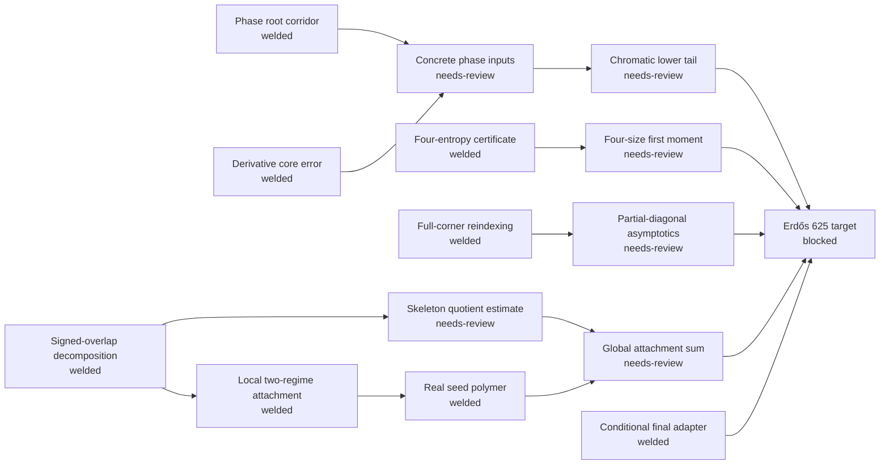

# Erdős 625 formalization DAG

The machine-readable graph is
`.agent-coordination/formalization-dag.json`. Its baseline is private `main` at
`32dfa812eeb4abc2f7afb377fb6a20c4802e2134`.

The repository has a large welded conditional infrastructure, but the exact
top-level proposition is not yet proved. The DAG prevents the size of that
infrastructure from being confused with completion of the remaining
quantitative obligations.



## Current statement-review frontier

These four nodes have only welded dependencies and should be specified before
any later node:

1. `E625-08-concrete-phase-inputs`
2. `E625-10-four-size-first-moment`
3. `E625-11-partial-diagonal-asymptotics`
4. `E625-12-skeleton-weight`

They are deliberately not `ready`. For each one, the next bounded obligation
is to extract a single exact declaration from the accepted mathematics,
including constants, asymptotic quantifiers, definitions, and a hypothesis
ledger. The proposed E625-LEMMA83 brief is only a clue: it references a
different public commit/toolchain and is not an approved private-baseline
target. The legacy Aristotle project
`9224a832-6aee-4d33-8645-d2cf4d43d6a9` is likewise quarantined because its
reported Lemma 9.1/Proposition 9.2 scope is not one frozen Lean declaration.

## What is already welded

- phase-root corridor and derivative affine-core control;
- finite signed four-size entropy certificate;
- exact full-corner reindexing;
- signed overlap/cycle-rank decomposition;
- local midpoint attachment estimate and real-seed conversion;
- the conditional Sections X–XI adapter from uniform seed/root hypotheses to
  `Erdos625Statement`.

## Operating commands

```text
python scripts/formalization_dag.py validate
python scripts/formalization_dag.py next
python scripts/formalization_dag.py hashes
python scripts/formalization_dag.py brief NODE_ID
```

`brief` is read-only and always emits `Aristotle authorization: NOT APPROVED`.
Use `.agent-coordination/theorem-briefs/TEMPLATE.md` for a proposed exact
brief and `.agents/workflows/advance-formalization-dag.md` for the private
agent loop.

## Promotion gates

`needs-review → frozen → ready → running → candidate → lean-validated → welded`

Only `lean-validated` and `welded` satisfy dependencies. A service result is
only `candidate`. `blocked` requires a concrete obstruction and never unlocks
a dependent node.

The public `SamPetkov/Erdos` PR stream is refreshed by exact mutable head,
including file edits, deletions, and renames. PR 42 is excluded as unrelated.
No step in this DAG writes to or merges a public repository.
