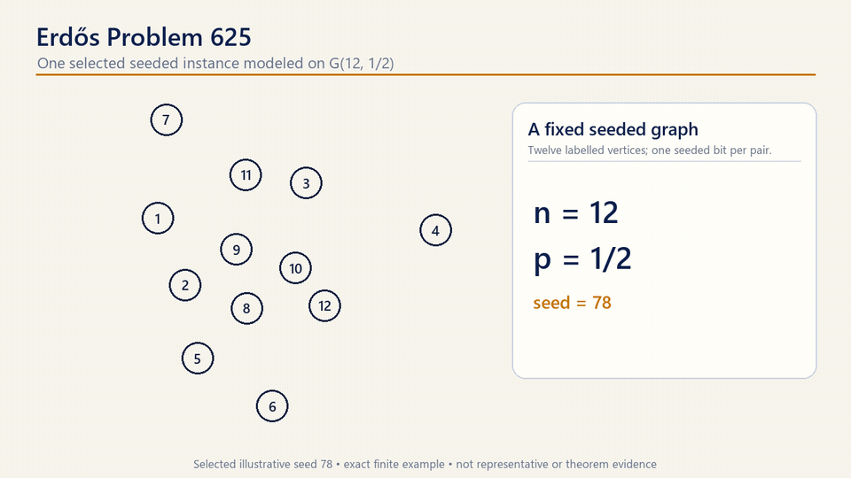

# Erdős Problem 625 research dossier

## Complete proof

**[Open the complete proof PDF](COMPLETE_PROOF_SELF_CONTAINED.pdf)**

**[Open the publication-layout preprint PDF](arxiv_625.pdf)**

The publication-layout PDF is dated 12 July 2026 and lists Samuil Petkov as
the sole author, with explicit AI-assistance, Aristotle-use, funding, and
competing-interests disclosures.  It remains a candidate preprint while the
full Lean target is open.

The editable canonical manuscript is
[`proofs/COMPLETE_PROOF_SELF_CONTAINED.md`](proofs/COMPLETE_PROOF_SELF_CONTAINED.md),
and the generated TeX is
[`output/tex/COMPLETE_PROOF_SELF_CONTAINED.tex`](output/tex/COMPLETE_PROOF_SELF_CONTAINED.tex).

  

<em>Schematic overview of the definitions and proposed theorem. The image is explanatory and is not proof evidence.</em>

## Animated exact example

  

<em>A selected, exactly solved 12-vertex illustration. Click for MP4. The seed was chosen to explain the two partitions; it is not representative, statistical, or asymptotic proof evidence.</em>

## Lean formalization

[`formalization/`](formalization/) contains the pinned Lean 4 formalization,
authored by **Samuil Petkov & ChatGPT 5.6**.  The accepted project is checked
locally with Lean/mathlib `v4.31.0`; optional Aristotle experiments remain
quarantined and are not imported.  The verified closure includes the labelled
finite-graph and `G(n,1/2)` model, chromatic/cochromatic semantics, exact phase
and independent-set asymptotics, Boolean-cube and variable-block bounded
differences, induced-capacity amplification bricks, and finite four-support
entropy/optimizer continuity.

The Section 4 layer now proves the exact unordered profile enumeration and
first-moment formula (4.2), zero-safe factorial/log-weight bounds, the finite
`(n+1)^b` aggregate exponential estimate, and exact equivalence with the
expanded discrete profile objective.  Natural profiles now embed exactly in
the constrained real profile space, and an abstract variational-envelope
theorem supplies the finite expectation interface.  A zero-safe Gibbs
inequality gives an explicit one-parameter dual domination for positive
support and part count and is composed with the sharp shifted finite
 probability bound.  The Gibbs mean now has its two endpoint limits and a
 unique interior target tilt; its positive optimizer exactly attains the fixed
 finite real-profile maximum.  The support is reindexed exactly by deficits
 with normalized tilt `λ=B_α-t`, and the inverse, entropy, and part-count
 envelope derivatives are kernel-checked.  The exceptional top residual is
 evaluated exactly and the full finite support has a pointwise Gaussian score
 bound.  Exact support reversal plus finite Gaussian-tail lemmas now give
 explicit growing-support partition, first-moment, and second-moment envelopes
 on every supplied bounded tilt interval, with a uniform denominator lower
 bound from the zero-deficit atom.  The limiting deficit Gaussian is defined
 with summable moments through order two and a strictly positive partition;
 its normalized mean has derivative equal to a strictly positive variance and
 has endpoint limits `-1` and `+∞`.  Hence every limiting target above `-1`
 has a unique finite tilt and compact target intervals admit fixed brackets.
The final phase-cap squeeze interface is also kernel-checked.  The layer
also constructs a nonempty kernel
partition from a coloring, refines it to exactly `k` parts, extracts the
bounded profile, and proves the deterministic event containment used in
(4.5), including all zero endpoints.  Finite-space Markov and union bounds
then give the exact probability reduction and its conditional
`(n+1)^b exp(L)+μ(n,b+1)` form.

The asymptotic target is deliberately recorded as an **unproved proposition**;
the current development is a verified partial formalization, not a completed
Lean proof of the manuscript.  Growing-support moments, compact-uniform
optimizer-tilt convergence, variance stability, and generic root/rounding
interfaces are kernel-checked.  In Section 4, the concrete phase objective,
its center/slope corridor, its integer decrement, and the resulting probability
limit remain open; the
signed first/second-moment, overlap, residual-attachment, and final
amplification layers also remain open.
See the [`formalization ledger`](formalization/FORMALIZATION_LEDGER.md) for the
declaration-by-declaration status and remaining dependency graph.  Reproduced
milestone evidence is recorded in the audit files under
[`formalization/`](formalization/); the latest growing-support, compact-tilt,
variance, and root-interface checkpoint is the
[`M7 audit`](formalization/M7_GROWING_SUPPORT_TILT_CORRIDOR_AUDIT_2026-07-14.md).  The
complete dependency/import policy is in
[`DEPENDENCY_REPRODUCIBILITY.md`](formalization/DEPENDENCY_REPRODUCIBILITY.md).
The current Sections 6--9 atomization, Aristotle quarantine status, and exact
non-atomic obligations are tracked in the
[`Sections 6--9 breakdown`](formalization/SECTIONS_6_9_BREAKDOWN_2026-07-14.md).

## Current status

`proofs/COMPLETE_PROOF_SELF_CONTAINED.md` contains a proposed all-`n` positive
resolution with the explicit bound

\[
 \chi(G(n,1/2))-\zeta(G(n,1/2))
 \ge \frac{(\ln2)^2\ln(200/153)}{32}
       \frac{n}{(\ln n)^3}
 \quad\text{with high probability}.
\]

The decisive overlap components passed focused independent audits, and four
independent end-to-end reconstructions each returned PASS.  A fresh
severity-ranked adversarial review on 2026-07-13 then found a circular signed-
root localization in the written proof, an unstated globalization step in the
high-skeleton sum, and a one-sided/two-sided overclaim in the residual lemma.
All three were repaired without changing the theorem or constant, and three
independent regression reviews returned PASS on the corrected passages.  See
[`audits/ADVERSARIAL_LEAP_AUDIT_2026-07-13.md`](audits/ADVERSARIAL_LEAP_AUDIT_2026-07-13.md).
The concise draft and the focused first-moment, dense-overlap, residual, and
amplification notes were subsequently synchronized to those repairs.  Their
cross-document mapping is recorded in
[`audits/PROOF_COMPONENT_SYNCHRONIZATION_AUDIT_2026-07-13.md`](audits/PROOF_COMPONENT_SYNCHRONIZATION_AUDIT_2026-07-13.md).
This is internal validation of a new argument, not external peer review,
publication, priority confirmation, or community acceptance.

A further user-supplied review dated 2026-07-12 reports **provisional internal
verification: PASS** and no blocking mathematical error.  Its separately
written checker reproduces five groups of finite diagnostic tests from
Sections 6 and 8.  The report, checker, reproduced output, provenance, and
limitations are indexed in [`verification/`](verification/).  This is
additional internal evidence, not external peer review or machine
verification, and the finite tests do not prove the asymptotic theorem.

As of 2026-07-12, the [public Problem 625 page](https://www.erdosproblems.com/625)
still labels the problem `OPEN`.  This repository presents a proposed
resolution for scrutiny and does not claim an official status change.

The current complete packaged dossier is available at
[`releases/Erdos-625-complete-dossier-2026-07-13.zip`](releases/Erdos-625-complete-dossier-2026-07-13.zip).

## Publication artifacts

The manuscript title block attributes co-authorship to **Samuil Petkov &
ChatGPT 5.6** in the canonical Markdown, generated TeX, and PDF.

- [`COMPLETE_PROOF_SELF_CONTAINED.pdf`](COMPLETE_PROOF_SELF_CONTAINED.pdf)
  - top-level convenience copy for immediate viewing on GitHub; byte-identical
    to the compiled PDF under `output/pdf/`.
- [`proofs/COMPLETE_PROOF_SELF_CONTAINED.md`](proofs/COMPLETE_PROOF_SELF_CONTAINED.md)
  - canonical self-contained Markdown manuscript.
- [`output/tex/COMPLETE_PROOF_SELF_CONTAINED.tex`](output/tex/COMPLETE_PROOF_SELF_CONTAINED.tex)
  - generated standalone TeX source with color-coded lemma/proposition boxes.
- [`output/pdf/COMPLETE_PROOF_SELF_CONTAINED.pdf`](output/pdf/COMPLETE_PROOF_SELF_CONTAINED.pdf)
  - compiled 27-page A4 PDF with proofs kept outside the statement boxes.
- [`output/README.md`](output/README.md) - build versions, hashes, and PDF QA.
- [`assets/erdos625-preview.png`](assets/erdos625-preview.png) - explanatory
  repository preview; schematic only, not proof evidence.
- [`assets/animations/erdos625-coloring-example.gif`](assets/animations/erdos625-coloring-example.gif)
  and [`erdos625-coloring-example.mp4`](assets/animations/erdos625-coloring-example.mp4)
  - GitHub-ready animation and linked HD video of an exactly solved finite
  example; see the [`animation build record`](assets/animations/).

## Proof authority and synchronized support

`proofs/COMPLETE_PROOF_SELF_CONTAINED.md` is the sole authoritative proof.
The TeX and PDF are generated publication forms of that manuscript.  The
component notes below retain focused derivations and route history; they have
been synchronized to the 2026-07-13 repairs but are supporting explanations,
not a second proof whose wording overrides the canonical manuscript.  If a
future discrepancy appears, the canonical manuscript controls and the
discrepancy must be logged.

- `proofs/COMPLETE_PROOF_DRAFT.md` — concise synchronized map of the theorem
  and its proof obligations.
- `proofs/ALPHA_MINUS_TWO_ROUTE.md` — synchronized support for the uniform
  root corridor, first-moment comparison, explicit constants, unrestricted
  chromatic lower location, and tangent-rounded integer profile.
- `proofs/FOUR_SIZE_PARTIAL_RATES.md` — exact common-diagonal sum `1+o(1)`.
- `proofs/DENSE_FOUR_TYPE_MATCHING.md` — synchronized support for all
  unequal-type containments, near-containments, the mixed middle strip, and
  the conditioned global sum over high skeletons.
- `proofs/RESIDUAL_ATTACHMENT.md` — synchronized one-sided upper bound for
  residual local and even-subgraph attachments after the large-cell matching
  is exposed.
- `proofs/ALON_CONCENTRATION_EXTENSION.md` — synchronized rare-event-to-whp
  transfer with the growing deterministic error/failure sequence used in the
  final event intersection.

## Independent audits

- `audits/ADVERSARIAL_LEAP_AUDIT_2026-07-13.md` — severity-ranked fresh
  audit, repair register, and independent regression results; internal pass
  after revision.
- `audits/PROOF_COMPONENT_SYNCHRONIZATION_AUDIT_2026-07-13.md` — traceability
  matrix confirming that the focused component notes reflect those repairs;
  no change to the canonical TeX/PDF content.
- `audits/RARE_EVENT_AMPLIFICATION_AUDIT.md` — pass.
- `audits/RESIDUAL_ATTACHMENT_AUDIT.md` and
  `audits/DENSE_FOUR_TYPE_MATCHING_AUDIT.md` — preserved internal 2026-07-12
  verdicts on the earlier component bytes; their top notices delimit scope.
- `audits/FULL_PROOF_AUDIT_1.md` through `_4.md` — preserved independent
  2026-07-12 reconstructions; all four passed the bytes then reviewed, and
  their top notices make clear that they are not reviews of later bytes.
- `verification/erdos625_verification_report.md` — additional provisional
  internal verification; pass, with formalization targets identified.
- `verification/erdos625_independent_checks.py` — separately written finite
  diagnostic checker; all five supplied check groups pass.

## Literature and known results

- `sources/SOURCE_LEDGER.md`
- `sources/RECENT_WORK_AUDIT.md`
- `sources/HISTORICAL_SOURCE_AUDIT.md`
- `sources/ERDOS625_REFERENCES.bib` -- reusable BibTeX for every reference
  cited in the canonical manuscript.
- `proofs/KNOWN_RESULTS_RECONSTRUCTION.md`
- `proofs/EXCEPTIONAL_REGIME.md`

The ledger records every source version and probability quantifier.  Every
historical Problem 625 source cited in the manuscript has been checked directly
for the claim attributed to it, with pages and SHA-256 identifiers recorded in
the historical audit.  Bibliographic metadata for the standard bounded-
differences and concentration references was verified against the publisher
and arXiv records.  The copyrighted PDFs remain local and are not redistributed
in this repository or its release archives.

## Reproducibility

- `experiments/alpha_minus_two_route.py` — phase-uniform entropy losses and
  certified constants.
- `experiments/dense_transport_scan.py` — exact finite falling-factorial
  diagnostics for dense typed transports.
- `experiments/constrained_profile_certify.py` and
  `experiments/finite_slack_profile.py` — exceptional-profile calculations.
- `experiments/exact_chi_zeta.py`, CSV, and report — certified finite graph
  computations (diagnostic only).
- `experiments/render_erdos625_animation.py` — deterministic GIF/MP4 renderer
  that revalidates the fixed graph and its exact partition witnesses before
  producing the README animation.

`WORK_LOG.md` and `MECHANISM_REGISTRY.md` record the investigation history,
failed routes, redirections, and precise remaining status.
`FINAL_VERIFICATION.md` records the full audit history, the 2026-07-13
adversarial repairs and regression results, the additional user-supplied
verification, reproducibility and publication checks, final hashes, and the
completed historical-source audit.

## Citation and license

The original repository material is licensed under
[CC BY 4.0](../LICENSE). When the license requires attribution, credit
**Samuil Petkov** and follow the repository-level
[scope and attribution notice](../LICENSE_SCOPE.md). Scholarly citation
metadata are provided in [`CITATION.cff`](../CITATION.cff).
