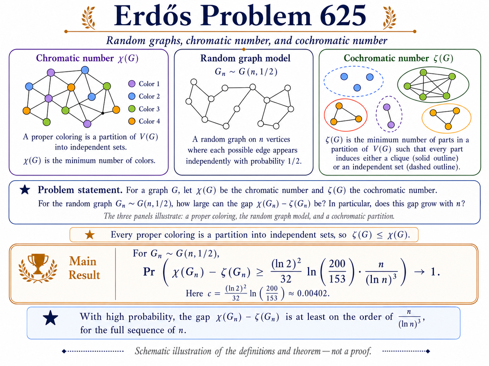

# Erdős Problem 625 research dossier

## Complete proof

**[Open the complete proof PDF](COMPLETE_PROOF_SELF_CONTAINED.pdf)**

The editable canonical manuscript is
[`proofs/COMPLETE_PROOF_SELF_CONTAINED.md`](proofs/COMPLETE_PROOF_SELF_CONTAINED.md),
and the generated TeX is
[`output/tex/COMPLETE_PROOF_SELF_CONTAINED.tex`](output/tex/COMPLETE_PROOF_SELF_CONTAINED.tex).

  

<em>Schematic overview of the definitions and proposed theorem. The image is explanatory and is not proof evidence.</em>

## Current status

`proofs/COMPLETE_PROOF_SELF_CONTAINED.md` contains a proposed all-`n` positive
resolution with the explicit bound

\[
 \chi(G(n,1/2))-\zeta(G(n,1/2))
 \ge \frac{(\ln2)^2\ln(200/153)}{32}
       \frac{n}{(\ln n)^3}
 \quad\text{with high probability}.
\]

The decisive overlap components passed focused independent audits, and four
independent end-to-end reconstructions each returned PASS.  A fresh
severity-ranked adversarial review on 2026-07-13 then found a circular signed-
root localization in the written proof, an unstated globalization step in the
high-skeleton sum, and a one-sided/two-sided overclaim in the residual lemma.
All three were repaired without changing the theorem or constant, and three
independent regression reviews returned PASS on the corrected passages.  See
[`audits/ADVERSARIAL_LEAP_AUDIT_2026-07-13.md`](audits/ADVERSARIAL_LEAP_AUDIT_2026-07-13.md).
This is internal validation of a new argument, not external peer review,
publication, priority confirmation, or community acceptance.

A further user-supplied review dated 2026-07-12 reports **provisional internal
verification: PASS** and no blocking mathematical error.  Its separately
written checker reproduces five groups of finite diagnostic tests from
Sections 6 and 8.  The report, checker, reproduced output, provenance, and
limitations are indexed in [`verification/`](verification/).  This is
additional internal evidence, not external peer review or machine
verification, and the finite tests do not prove the asymptotic theorem.

As of 2026-07-12, the [public Problem 625 page](https://www.erdosproblems.com/625)
still labels the problem `OPEN`.  This repository presents a proposed
resolution for scrutiny and does not claim an official status change.

The current complete packaged dossier is available at
[`releases/Erdos-625-complete-dossier-2026-07-13.zip`](releases/Erdos-625-complete-dossier-2026-07-13.zip).

## Publication artifacts

The manuscript title block attributes co-authorship to **Samuil Petkov &
ChatGPT 5.6** in the canonical Markdown, generated TeX, and PDF.

- [`COMPLETE_PROOF_SELF_CONTAINED.pdf`](COMPLETE_PROOF_SELF_CONTAINED.pdf)
  - top-level convenience copy for immediate viewing on GitHub; byte-identical
    to the compiled PDF under `output/pdf/`.
- [`proofs/COMPLETE_PROOF_SELF_CONTAINED.md`](proofs/COMPLETE_PROOF_SELF_CONTAINED.md)
  - canonical self-contained Markdown manuscript.
- [`output/tex/COMPLETE_PROOF_SELF_CONTAINED.tex`](output/tex/COMPLETE_PROOF_SELF_CONTAINED.tex)
  - generated standalone TeX source with color-coded lemma/proposition boxes.
- [`output/pdf/COMPLETE_PROOF_SELF_CONTAINED.pdf`](output/pdf/COMPLETE_PROOF_SELF_CONTAINED.pdf)
  - compiled 27-page A4 PDF with proofs kept outside the statement boxes.
- [`output/README.md`](output/README.md) - build versions, hashes, and PDF QA.
- [`assets/erdos625-preview.png`](assets/erdos625-preview.png) - explanatory
  repository preview; schematic only, not proof evidence.

## Main proof chain

- `proofs/COMPLETE_PROOF_SELF_CONTAINED.md` — consolidated paper-style proof
  with all substantive lemmas proved in one document.
- `proofs/COMPLETE_PROOF_DRAFT.md` — assembled theorem and proof.
- `proofs/ALPHA_MINUS_TWO_ROUTE.md` — all-phase first-moment comparison,
  explicit constants, unrestricted chromatic lower location, and integer
  midpoint profile.
- `proofs/FOUR_SIZE_PARTIAL_RATES.md` — exact common-diagonal sum `1+o(1)`.
- `proofs/DENSE_FOUR_TYPE_MATCHING.md` — all unequal-type containments,
  near-containments, and the mixed middle strip.
- `proofs/RESIDUAL_ATTACHMENT.md` — all residual local and even-subgraph
  attachments after the large-cell matching is exposed.
- `proofs/ALON_CONCENTRATION_EXTENSION.md` — rare-event-to-whp transfer.

## Independent audits

- `audits/ADVERSARIAL_LEAP_AUDIT_2026-07-13.md` — severity-ranked fresh
  audit, repair register, and independent regression results; internal pass
  after revision.
- `audits/RARE_EVENT_AMPLIFICATION_AUDIT.md` — pass.
- `audits/RESIDUAL_ATTACHMENT_AUDIT.md` — pass.
- `audits/DENSE_FOUR_TYPE_MATCHING_AUDIT.md` — pass.
- `audits/FULL_PROOF_AUDIT_1.md` through `_4.md` — independent full-chain
  reconstructions; all four pass.
- `verification/erdos625_verification_report.md` — additional provisional
  internal verification; pass, with formalization targets identified.
- `verification/erdos625_independent_checks.py` — separately written finite
  diagnostic checker; all five supplied check groups pass.

## Literature and known results

- `sources/SOURCE_LEDGER.md`
- `sources/RECENT_WORK_AUDIT.md`
- `sources/HISTORICAL_SOURCE_AUDIT.md`
- `sources/ERDOS625_REFERENCES.bib` -- reusable BibTeX for every reference
  cited in the canonical manuscript.
- `proofs/KNOWN_RESULTS_RECONSTRUCTION.md`
- `proofs/EXCEPTIONAL_REGIME.md`

The ledger records every source version and probability quantifier.  Every
historical Problem 625 source cited in the manuscript has been checked directly
for the claim attributed to it, with pages and SHA-256 identifiers recorded in
the historical audit.  Bibliographic metadata for the standard bounded-
differences and concentration references was verified against the publisher
and arXiv records.  The copyrighted PDFs remain local and are not redistributed
in this repository or its release archives.

## Reproducibility

- `experiments/alpha_minus_two_route.py` — phase-uniform entropy losses and
  certified constants.
- `experiments/dense_transport_scan.py` — exact finite falling-factorial
  diagnostics for dense typed transports.
- `experiments/constrained_profile_certify.py` and
  `experiments/finite_slack_profile.py` — exceptional-profile calculations.
- `experiments/exact_chi_zeta.py`, CSV, and report — certified finite graph
  computations (diagnostic only).

`WORK_LOG.md` and `MECHANISM_REGISTRY.md` record the investigation history,
failed routes, redirections, and precise remaining status.
`FINAL_VERIFICATION.md` records the full audit history, the 2026-07-13
adversarial repairs and regression results, the additional user-supplied
verification, reproducibility and publication checks, final hashes, and the
completed historical-source audit.
