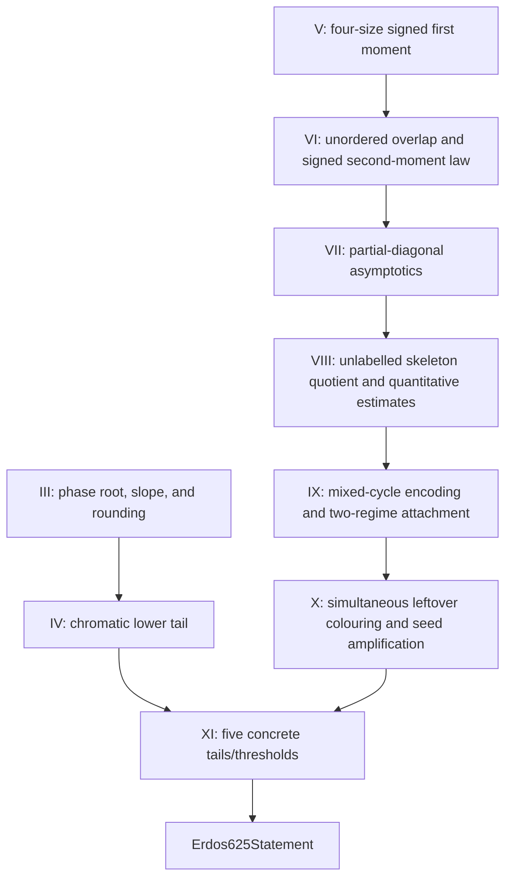

# Remaining Lean formalization plan — 2026-07-16

## Status boundary

The tracked Lean development has a warning-fatal modular build, a fresh
generated self-contained file, placeholder and project-axiom gates, and the
standard Mathlib axiom audit.  This is a strong verified partial
formalization, but it is **not yet a proof of `Erdos625Statement`**.

The final theorem is still

```lean
def Erdos625Statement : Prop :=
  Tendsto gapProbability atTop (nhds 1)
```

and the repository contains a generic conditional five-input route plus a
quarter-chain specialization with four remaining inputs.  The
remaining work is substantive mathematics, concentrated in the phase/root
asymptotics, the signed moment corridor, the Section VIII skeleton estimates,
the Section IX attachment estimate, and the concrete Section X--XI
instantiation.

## Model and review policy

The names below are workload tiers.  If the agent launcher does not expose a
model selector, the same task boundaries and review gates still apply.

| Tier | Appropriate work | Inappropriate work |
|---|---|---|
| **Sol Ultra** | exact theorem and quantifier design; adversarial mathematical review; Sections III--IX bottlenecks; constants and uniformity; final semantic audit | bulk mechanical editing without a bounded specification |
| **Terra Ultra** | deep but bounded Lean implementation after Sol fixes the statement: skeleton quotient, mixed-cycle code, asymptotic packages, major integration modules | choosing a new mathematical route or silently changing the target |
| **Terra Max** | medium finite combinatorics, probability/event adapters, casts, floors/ceilings, sequence arithmetic, module integration | owning the final correctness decision for a high-risk theorem |
| **Luna Max/Ultra** | small exact leaves, API lookup, finite-set plumbing, reindexing, monotonicity, measurability, trust scans, CI monitoring, documentation reconciliation | core probabilistic estimates, global uniformity, or final theorem review |

Every delegated result is quarantined until a Sol-level review confirms:

1. exact statement and quantifier fidelity;
2. no hidden strengthening of hypotheses or weakening of conclusions;
3. warning-fatal Lean 4.31 replay;
4. no `sorry`, `admit`, project axiom, `unsafe`, or trust escape;
5. a standard-axiom `#print axioms` report;
6. integration into the modular imports, generated self-contained file,
   ledger, and green GitHub Actions.

Aristotle remains an auxiliary theorem-scoped proof-search service.  It is
appropriate for small, faithful leaves after their statements are fixed.  A
service output is never repository authority by itself, and monolithic
requests for Lemma 8.3, Lemma 9.1, or the final theorem are not an acceptable
substitute for the dependency graph below.

## Dependency graph



Sections III--IV and V--IX are independent lanes until the concrete final
tail assembly.  Section X can continue through its deterministic
quarter-density/greedy lane while the Section IX rare seed is still open.

## Work package A — Sections III--IV

### A1. Phase-root completion

Compose the accepted growing-support moments and compact-uniform selected-tilt
convergence with the phase part-count objective.  Prove:

- the scalar root corridor and uniqueness at the manuscript scale;
- a uniform lower slope bound at that root;
- the real-to-integer rounding decrement with its exact sign and error.

**Owner:** Sol Ultra designs and audits; Terra Ultra implements bounded
analytic modules; Luna handles isolated continuity, cast, and rounding leaves.

### A2. Chromatic lower tail

Insert the root choice into the attained finite profile maximum and prove that
the accepted finite Markov/dual upper bound tends to zero.  This must produce
the concrete full-sequence input

```lean
Tendsto
  (fun n => randomGraphMeasure n {G | chromaticNumberNat G ≤ kChi n})
  atTop
  (nhds 0).
```

**Owner:** Sol Ultra for the asymptotic argument and target comparison; Terra
Ultra for Lean implementation.

## Work package B — Sections V--VII

### B1. Four-size signed first moment

Formalize Lemma 5.1 with one uniform entropy certificate over all four sizes.
Keep endpoint and empty-profile cases explicit.

### B2. Signed second-moment law

Complete the unordered-profile ordering quotient, exact sign/component
factors, sign-summed law, and configuration-model bridge of Lemma 6.1.

### B3. Partial-diagonal ranges

Prove all ranges in (7.7)--(7.25), with the empty, central, and full corners
represented separately.  Do not collapse the ranges into one bound unless the
Lean theorem retains every manuscript hypothesis and endpoint.

**Owner for B1--B3:** Sol Ultra specifies the entropy and range decomposition;
Terra Ultra implements; Terra Max/Luna may take finite reindexing and endpoint
leaves.  Sol reviews signs, normalizations, and uniformity.

## Work package C — Section VIII

The fixed-demand law, canonical witness fibres, residual configuration
equivalence, incidence algebra, endpoint factorial transport, and generic
weighted Cauchy inequality are already accepted.  Do not reimplement them.

Remaining order:

1. **Partly completed:** define the physical **unlabelled typed skeleton** and
   its type-table map.  The exact fibre equivalence and one-factorial
   cardinality identity are proved; the manuscript weight remains open;
2. re-express the native incidence/event package (8.3) for that skeleton;
3. **Partly completed:** quotient the cellwise typed partial-matchings by
   their physical skeleton.  The exact fibre multiplicity is proved; the
   weighted quotient sum and `W(L)` ratio factors remain open;
4. specialize endpoint transport and weighted Cauchy to the actual weights;
5. prove the `A₀` base case, near and middle ranges, ratio bounds, and uniform
   `Xi₄` decay;
6. assemble Lemmas 8.1--8.3.

**Owner:** Sol Ultra fixes the skeleton and quotient specification and leads
the quantitative estimates.  Terra Ultra implements the type, quotient, and
major estimate modules.  Terra Max/Luna may handle individual factorial and
finite-sum rewrites only after the exact interfaces exist.

Critical rejection rules:

- forgetting labels is not multiplicity-free without an exact fibre count;
- a distinguishable-cell product expansion is not yet the unlabelled
  skeleton sum;
- an endpoint Cauchy lemma is not Lemma 8.3 without the near/middle estimates.

## Work package D — Section IX

The residual family, degree/cap estimates, cycle-space cardinality, generic
polymer bounds, traversal kernels, explicit path terms, small-residual
deterministic integrand bound, the faithful physical cut of one eligible
cycle, its canonical injective source-free encoder with exact per-code weight,
its finite dependent marked packaging and aggregate traversal domination, the
abstract geometric enumeration, and its deterministic literal-`residualQ`
specialization are accepted.  The canonical positive-support matching seam,
fixed-`F` local-factor separation, finite even-family aggregation, exact local-
reward compatibility, the exact unnormalised fixed-family Fubini identity and
polymer bound, and the exact mixed/residual-only cycle partition are also
accepted.  The remaining bridge is:

```text
actual residual even set
  -> attained canonical positive support is a matching under caps [proved]
  -> recoverable minimal mixed cycles
  -> marked/oriented/cut walk blocks [proved cycle by cycle]
  -> canonical injective weight-preserving code [proved]
  -> dependent marked-start/block-count packaging [proved]
  -> finite weighted reindexing and traversal domination [proved]
  -> abstract geometric traversal bound with one 2|M| cost [proved]
  -> literal residualQ mixed-cycle bound under tau < 1/3 [proved]
  -> fixed-F local-factor and finite even-family polymer aggregation [proved]
  -> unnormalised actual-attachment numerator identity and polymer bound [proved]
  -> exact mixed/residual-only simple-cycle partition [proved]
  -> conditional normalization and residual-only-cycle bound
  -> tagged residual PMF and uniform strict-regime integration
  -> faithful large- and small-residual expectation estimates
  -> Lemma 9.1 and Proposition 9.2
```

Implementation order:

1. **Completed:** prove that a minimal nonempty even bipartite edge set admits
   a covering cycle walk;
2. **Completed finite relaxation:** exact recursive path codes preserve every
   internal-vertex multiplicity, and exact relaxed block-chain codes sum to
   the endpoint mass of the iterated composed kernel;
3. **Completed target interface:** define a source-free closed mixed-cycle
   block code without a source cycle or stored reconstruction/injectivity
   certificate; prove its decoder, projection, no-drop, closure, cutoff, and
   exact nonnegative physical product-weight lemmas;
4. **Completed physical construction:** prove
   `physicalCycleCuttingStatement`, namely existence of a faithful source-free
   code for each eligible physical cycle, with exact block count, marked final
   transition, decoding, cutoff, no-drop, and nodup fields;
5. **Completed canonical encoder:** choose one faithful source-free code for
   every mixed simple cycle, prove decoding is a left inverse and hence the
   encoder is injective, and transport the exact physical residual weight;
6. **Completed dependent enumeration:** package the encoder by its dependent
   marked start and block count, prove the finite weighted reindexing and
   domination by the complete relaxed traversal enumeration, and retain the
   single `2 * |M|` marked-start cost already isolated by the matching bridge;
7. **Completed deterministic specialization:** compose the endpoint row bound
   and matching partial-permutation kernel with the aggregate enumeration,
   retaining exactly one `2 * |M|` cost, and specialize it to literal
   `residualQ` under the exact finite hypotheses and explicit `tau < 1/3`
   premise;
8. **Completed finite algebra:** identify the two local reward presentations,
   separate the common local factors for one fixed `F`, sum that inequality
   over every even `F`, bound the result by the simple-cycle polymer product,
   identify the sum exactly with the unnormalised actual-attachment numerator,
   transfer both even-weight and polymer bounds to that numerator, and split
   the cycle sum exactly into mixed and residual-only terms;
9. normalize the retained cap/no-return event mass to the required conditional
   expectation and bound the residual-only cycle term;
10. transport the result through the tagged dependent residual law and
   instantiate the strict regime uniformly;
11. prove one deterministic threshold and one error sequence uniform over all
   feasible skeletons in the two residual-mass regimes;
12. assemble Lemma 9.1 and Proposition 9.2.

The accepted enumeration modules close exact path multiplicity, relaxed
block-chain summation, minimal cycle coverage, and the source-free decoder,
no-drop, and exact physical-weight target interface.
`physicalCycleCuttingStatement` now proves the physical marked/oriented
cycle-cut existence theorem, and `chosenPhysicalCycleCut` supplies a canonical
source-free encoder with a decoder left inverse, injectivity, and exact weight.
`MarkedCycleTraversalCode` supplies the data-only dependent packaging, exact
endpoint enumeration, and aggregate mixed-cycle-to-nested-walk domination.
`mixedSimpleCycle_weighted_walk_enumeration` and
`existsAbsoluteResidualQMixedCycleWeightedEnumeration` supply the abstract
geometric estimate and its deterministic literal-`residualQ` specialization.
The fixed-`F` factorization and finite even-family polymer aggregation are now
proved, and the exact finite Fubini bridge identifies their sum with the
unnormalised actual-attachment numerator and transfers the polymer bound to it.
Reward compatibility, canonical-support matchingness, and the exact mixed/
residual-only cycle partition are also proved.  Conditional normalization,
bounding the residual-only term, tagged residual-PMF integration, the later Section IX attachment/
probability estimates, and `Erdos625Statement` remain open.

**Owner:** Sol Ultra designs the code and the uniform two-regime theorem.
Terra Ultra implements the code and major finite enumeration.  Terra Max may
implement the literal kernel specialization.  Luna may prove product
reindexing and arithmetic leaves once the dependent enumeration packaging is
fixed.

Critical rejection rules:

- the old unrestricted `sum_fourpow_le` shortcut is false because it removes
  the cap/no-return event;
- the residual law remains tagged by demand and witness; there is no common
  untagged residual PMF;
- the generic polymer endpoint is not the attachment estimate;
- an encoding may not be made tautological by adding a pre-existing code
  certificate to its input.

## Work package E — Section X

The fixed induced law, simultaneous all-larger quarter-density event,
probability-one limit, exact clique-chain theorem, chosen-scale survival leaf,
greedy recursion, capacity concentration, deterministic capacity/leftover
bridge, and scale algebra are accepted.

### E1. Immediate small leaves

Now accepted:

- eventually `quarterDensityCutoff n ≤ quarterChainStart n`;
- eventually `1 ≤ quarterDensityCutoff n`;
- eventually `1 ≤ quarterChainSteps n`;
- an explicit logarithmic lower bound for `quarterChainSteps`;
- exact-start subset selection;
- complement clique implies original independent set;
- the needed `ceilDivNat` and complement-cardinality monotonicity facts.

**Owner:** Luna for finite-set/graph leaves, Terra Max for floors/logarithms,
Sol audit of constants.

### E2. Uniform independent block and greedy bound

The structural part is now accepted.  On the one event
`cutoffComplementAllLargerQuarterDenseEvent n`, prove simultaneously for every
`U` with `quarterChainStart n ≤ U.card` that `U` contains an independent set
of cardinality `quarterChainSteps n`.  Then instantiate
`simultaneous_induced_chromatic_bound`.

This has been implemented as `quarterChainIndependentBlockEvent`, whose
probability tends to one, together with the exact ceiling-division greedy
bound.  No pointwise-in-`U` exceptional event is used.  The explicit
manuscript-constant conversion is also accepted in
`Section10QuarterChainGreedyNumeric.lean`, with the faithful piecewise cost and
the positive choice `C = 14 * log 4 + 2`.

**Owner:** Terra Max/Ultra implementation; Sol statement and semantic review.

### E3. Parameter-independent leftover failure

Accepted.  `Section10QuarterChainFailure.lean` defines the error sequence using
only the complement of the single independent-block event and proves that it
tends to zero independently of `k`, `Lambda`, and `r`.
`Section10QuarterChainLinearEvent.lean` closes the exact one-event
manuscript-form Lemma 10.1, and
`Section10QuarterChainLeftoverEvent.lean` supplies the deficit-indexed
simultaneous leftover tail and its fixed-index quantitative failure bound.

### E4. Uniform Lemma 10.2

Accepted in `Section10UniformAmplification.lean`.  It uses the fixed-index
capacity failure bound, the two-success-event union seam, capacity-radius
comparison, the simultaneous linear-colouring event, and the deterministic
cochromatic bridge.  Its theorem chooses one absolute `C ≥ 1` and one
nonnegative deterministic `epsilon_n → 0` before all deterministic `k_n`,
`Lambda_n`, and `r_n`, then proves the eventual
`exp(-r_n) + epsilon_n` failure bound under the displayed seed inequality.
No independence is assumed.

`Section10UniformAmplificationSpecialization.lean` now proves the exact
radius/error identity, exponential-radius decay, the complement-real
probability bridge, and the conditional `o(gapBase)`/probability-one
specialization.  The remaining E-layer obligation is the concrete midpoint
`kCo`/`Lambda` seed and its Section IX asymptotics.  Those inputs are not hidden
inside either accepted amplification theorem.

**Acceptance audit for E3--E4:** Sol-level quantifier and constant review;
warning-fatal Lean 4.31 build; trust scan; and public `#print axioms` audit.

## Work package F — Section XI and final closure

The final plumbing is accepted.  The generic conditional theorem requires:

1. `hCapacityTail`;
2. `hLeftoverTail`;
3. `hChromaticTail`;
4. `hCochromaticThreshold`;
5. `hGapThreshold`.

Once Work Packages A--D and the concrete Section IX seed/`Lambda`
specialization supply these inputs, instantiate
`erdos625Statement_of_capacity_leftover_thresholds`.  Then derive every fixed
threshold statement from the accepted scale-divergence and moving-threshold
lemmas.  The quarter-chain specialization
`erdos625Statement_of_capacity_quarterChainLeftover_thresholds` now discharges
`hLeftoverTail`, leaving four concrete inputs: capacity tail, chromatic tail,
cochromatic threshold, and gap threshold.

**Owner:** Sol Ultra performs the final semantic comparison between the Lean
statement and Problem 625.  Terra Max performs the short Lean assembly.  A
second independent Sol-level audit checks quantifiers, full-sequence limits,
strict inequalities, rounding, and the final `#print axioms` report.

## Immediate execution queue

1. **Completed:** Section X parameter, graph-adapter, and survival-transport
   leaves.
2. **Completed:** the density-event-to-independent-block implication and its
   probability-one limit.
3. **Completed:** the exact simultaneous greedy bound is converted to the
   manuscript constant; exact Lemma 10.1, the parameter-independent failure,
   and the deficit-indexed leftover tail are formalized.
4. **Completed:** the quantifier-correct uniform Lemma 10.2 is assembled with
   `C ≥ 1`, nonnegative `epsilon_n → 0`, and the required quantifier order;
   its manuscript-radius specialization proves the exact error identity,
   negligible loss, and conditional probability-one conclusion.
5. **Next/in parallel:** Section VIII weighted skeleton quotient/ratio bounds
   and the Section IX conditional normalization,
   residual-only cycle control, tagged residual-PMF integration, and uniform
   strict-regime bridge, with priority on the concrete Section IX seed and
   `Lambda` asymptotics consumed by Lemma 10.2.
6. **After those foundations:** delegate their bounded quotient, reindexing,
   kernel, and arithmetic leaves.
7. **Final:** integrate the concrete chromatic and cochromatic tails through
   the four-input quarter-chain specialization of the existing seam.

No milestone is described as a complete resolution until
`Erdos625Statement` itself is kernel-checked under the repository trust gates.
