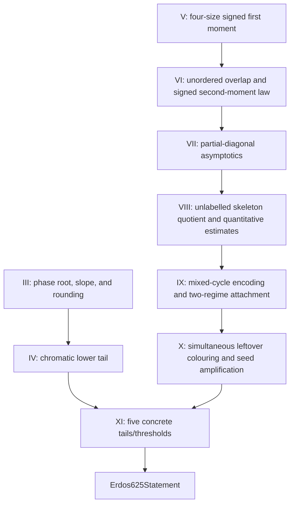

# Remaining Lean formalization plan — 2026-07-16

## Status boundary

The tracked Lean development has a warning-fatal modular build, a fresh
generated self-contained file, placeholder and project-axiom gates, and the
standard Mathlib axiom audit.  This is a strong verified partial
formalization, but it is **not yet a proof of `Erdos625Statement`**.

The final theorem is still

```lean
def Erdos625Statement : Prop :=
  Tendsto gapProbability atTop (nhds 1)
```

and the repository contains only a conditional five-input route to it.  The
remaining work is substantive mathematics, concentrated in the phase/root
asymptotics, the signed moment corridor, the Section VIII skeleton estimates,
the Section IX attachment estimate, and the concrete Section X--XI
instantiation.

## Model and review policy

The names below are workload tiers.  If the agent launcher does not expose a
model selector, the same task boundaries and review gates still apply.

| Tier | Appropriate work | Inappropriate work |
|---|---|---|
| **Sol Ultra** | exact theorem and quantifier design; adversarial mathematical review; Sections III--IX bottlenecks; constants and uniformity; final semantic audit | bulk mechanical editing without a bounded specification |
| **Terra Ultra** | deep but bounded Lean implementation after Sol fixes the statement: skeleton quotient, mixed-cycle code, asymptotic packages, major integration modules | choosing a new mathematical route or silently changing the target |
| **Terra Max** | medium finite combinatorics, probability/event adapters, casts, floors/ceilings, sequence arithmetic, module integration | owning the final correctness decision for a high-risk theorem |
| **Luna Max/Ultra** | small exact leaves, API lookup, finite-set plumbing, reindexing, monotonicity, measurability, trust scans, CI monitoring, documentation reconciliation | core probabilistic estimates, global uniformity, or final theorem review |

Every delegated result is quarantined until a Sol-level review confirms:

1. exact statement and quantifier fidelity;
2. no hidden strengthening of hypotheses or weakening of conclusions;
3. warning-fatal Lean 4.31 replay;
4. no `sorry`, `admit`, project axiom, `unsafe`, or trust escape;
5. a standard-axiom `#print axioms` report;
6. integration into the modular imports, generated self-contained file,
   ledger, and green GitHub Actions.

Aristotle remains an auxiliary theorem-scoped proof-search service.  It is
appropriate for small, faithful leaves after their statements are fixed.  A
service output is never repository authority by itself, and monolithic
requests for Lemma 8.3, Lemma 9.1, or the final theorem are not an acceptable
substitute for the dependency graph below.

## Dependency graph



Sections III--IV and V--IX are independent lanes until the concrete final
tail assembly.  Section X can continue through its deterministic
quarter-density/greedy lane while the Section IX rare seed is still open.

## Work package A — Sections III--IV

### A1. Phase-root completion

Compose the accepted growing-support moments and compact-uniform selected-tilt
convergence with the phase part-count objective.  Prove:

- the scalar root corridor and uniqueness at the manuscript scale;
- a uniform lower slope bound at that root;
- the real-to-integer rounding decrement with its exact sign and error.

**Owner:** Sol Ultra designs and audits; Terra Ultra implements bounded
analytic modules; Luna handles isolated continuity, cast, and rounding leaves.

### A2. Chromatic lower tail

Insert the root choice into the attained finite profile maximum and prove that
the accepted finite Markov/dual upper bound tends to zero.  This must produce
the concrete full-sequence input

```lean
Tendsto
  (fun n => randomGraphMeasure n {G | chromaticNumberNat G ≤ kChi n})
  atTop
  (nhds 0).
```

**Owner:** Sol Ultra for the asymptotic argument and target comparison; Terra
Ultra for Lean implementation.

## Work package B — Sections V--VII

### B1. Four-size signed first moment

Formalize Lemma 5.1 with one uniform entropy certificate over all four sizes.
Keep endpoint and empty-profile cases explicit.

### B2. Signed second-moment law

Complete the unordered-profile ordering quotient, exact sign/component
factors, sign-summed law, and configuration-model bridge of Lemma 6.1.

### B3. Partial-diagonal ranges

Prove all ranges in (7.7)--(7.25), with the empty, central, and full corners
represented separately.  Do not collapse the ranges into one bound unless the
Lean theorem retains every manuscript hypothesis and endpoint.

**Owner for B1--B3:** Sol Ultra specifies the entropy and range decomposition;
Terra Ultra implements; Terra Max/Luna may take finite reindexing and endpoint
leaves.  Sol reviews signs, normalizations, and uniformity.

## Work package C — Section VIII

The fixed-demand law, canonical witness fibres, residual configuration
equivalence, incidence algebra, endpoint factorial transport, and generic
weighted Cauchy inequality are already accepted.  Do not reimplement them.

Remaining order:

1. define the manuscript's **unlabelled typed skeleton**, demand map, and
   exact weight;
2. re-express the native incidence/event package (8.3) for that skeleton;
3. quotient labelled typed partial matchings and prove the exact fibre
   multiplicity and `W(L)` ratio factors;
4. specialize endpoint transport and weighted Cauchy to the actual weights;
5. prove the `A₀` base case, near and middle ranges, ratio bounds, and uniform
   `Xi₄` decay;
6. assemble Lemmas 8.1--8.3.

**Owner:** Sol Ultra fixes the skeleton and quotient specification and leads
the quantitative estimates.  Terra Ultra implements the type, quotient, and
major estimate modules.  Terra Max/Luna may handle individual factorial and
finite-sum rewrites only after the exact interfaces exist.

Critical rejection rules:

- forgetting labels is not multiplicity-free without an exact fibre count;
- a distinguishable-cell product expansion is not yet the unlabelled
  skeleton sum;
- an endpoint Cauchy lemma is not Lemma 8.3 without the near/middle estimates.

## Work package D — Section IX

The residual family, degree/cap estimates, cycle-space cardinality, generic
polymer bounds, traversal kernels, explicit path terms, and small-residual
deterministic integrand bound are accepted.  The missing bridge is:

```text
actual residual even set
  -> recoverable minimal mixed cycles
  -> marked/oriented/cut walk blocks
  -> injective weight-preserving code
  -> residualQ traversal bound
  -> faithful large-/small-residual expectation estimates
  -> Lemma 9.1 and Proposition 9.2
```

Implementation order:

1. prove that a minimal nonempty even bipartite edge set admits a covering
   cycle walk;
2. define the mixed-cycle block code, including enough reconstruction data
   without putting the desired encoding certificate into the input type;
3. prove code reconstruction, injectivity, and weight preservation;
4. instantiate the accepted traversal kernel with the literal `residualQ`;
5. retain the single `2 * |M|` marked-start cost;
6. transport the bound through the tagged dependent residual law;
7. prove one deterministic threshold and one error sequence uniform over all
   feasible skeletons in the two residual-mass regimes;
8. assemble Lemma 9.1 and Proposition 9.2.

**Owner:** Sol Ultra designs the code and the uniform two-regime theorem.
Terra Ultra implements the code and major finite enumeration.  Terra Max may
implement the literal kernel specialization.  Luna may prove product
reindexing and injectivity leaves only after the reconstruction interface is
fixed.

Critical rejection rules:

- the old unrestricted `sum_fourpow_le` shortcut is false because it removes
  the cap/no-return event;
- the residual law remains tagged by demand and witness; there is no common
  untagged residual PMF;
- the generic polymer endpoint is not the attachment estimate;
- an encoding may not be made tautological by adding a pre-existing code
  certificate to its input.

## Work package E — Section X

The fixed induced law, simultaneous all-larger quarter-density event,
probability-one limit, exact clique-chain theorem, chosen-scale survival leaf,
greedy recursion, capacity concentration, deterministic capacity/leftover
bridge, and scale algebra are accepted.

### E1. Immediate small leaves

Prove:

- eventually `quarterDensityCutoff n ≤ quarterChainStart n`;
- eventually `1 ≤ quarterDensityCutoff n`;
- eventually `1 ≤ quarterChainSteps n`;
- an explicit logarithmic lower bound for `quarterChainSteps`;
- exact-start subset selection;
- complement clique implies original independent set;
- the needed `ceilDivNat` and complement-cardinality monotonicity facts.

**Owner:** Luna for finite-set/graph leaves, Terra Max for floors/logarithms,
Sol audit of constants.

### E2. Uniform independent block and greedy bound

On the one event
`cutoffComplementAllLargerQuarterDenseEvent n`, prove simultaneously for every
`U` with `quarterChainStart n ≤ U.card` that `U` contains an independent set
of cardinality `quarterChainSteps n`.  Then instantiate
`simultaneous_induced_chromatic_bound`.

No pointwise-in-`U` exceptional event is acceptable.

**Owner:** Terra Max/Ultra implementation; Sol statement and semantic review.

### E3. Parameter-independent leftover failure

Define the leftover bound and an error sequence using only the complement of
the single density event.  Prove the error tends to zero and is independent of
`k`, `Lambda`, and `r`.

### E4. Uniform Lemma 10.2

Use the fixed-`n` bound
`capacityDeficitEvent_compl_probability_le`, not the weaker asymptotic helper
that assumes `r -> infinity`.  Combine it with
`failure_probability_le_add_of_two_success_events`, capacity-radius rounding,
the simultaneous leftover event, and the deterministic cochromatic bridge.
Choose the absolute constant and the deterministic error sequence before all
parameter sequences.

**Owner for E3--E4:** Sol designs/audits quantifier order and constants; Terra
Ultra implements; Luna handles isolated measure/complement and rounding
leaves.

## Work package F — Section XI and final closure

The final plumbing is accepted.  The conditional theorem requires exactly:

1. `hCapacityTail`;
2. `hLeftoverTail`;
3. `hChromaticTail`;
4. `hCochromaticThreshold`;
5. `hGapThreshold`.

Once Work Packages A--E supply these concrete inputs, instantiate
`erdos625Statement_of_capacity_leftover_thresholds`.  Then derive every fixed
threshold statement from the accepted scale-divergence and moving-threshold
lemmas.

**Owner:** Sol Ultra performs the final semantic comparison between the Lean
statement and Problem 625.  Terra Max performs the short Lean assembly.  A
second independent Sol-level audit checks quantifiers, full-sequence limits,
strict inequalities, rounding, and the final `#print axioms` report.

## Immediate execution queue

1. **Running:** Section X parameter and graph-adapter leaves.
2. **Next:** one module proving the density-event-to-independent-block
   implication.
3. **Then:** instantiate the simultaneous greedy theorem and define the
   parameter-independent leftover error.
4. **In parallel after Sol specification:** Section VIII skeleton type and
   Section IX mixed-cycle code foundations.
5. **After those foundations:** delegate their bounded quotient, reindexing,
   kernel, and arithmetic leaves.
6. **Final:** integrate the concrete chromatic and cochromatic tails through
   the existing five-input seam.

No milestone is described as a complete resolution until
`Erdos625Statement` itself is kernel-checked under the repository trust gates.
