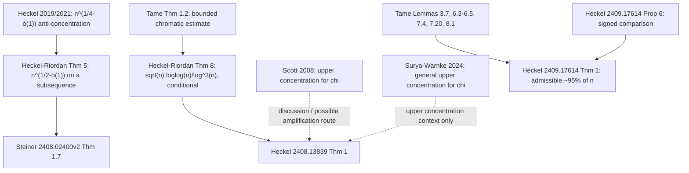

# Recent-work audit for Erdős Problem #625

**Status:** Phase-2 primary-source and quantifier audit, not a claimed solution.  
**Audit date:** 2026-07-11 (Europe/Kiev).  
**Question in scope:** for $G_n\sim G(n,1/2)$, does
\[
\forall M\in\mathbb N,\qquad
\Pr\!\left(\chi(G_n)-\zeta(G_n)\ge M\right)\longrightarrow1?
\]

This file audits the eight requested arXiv works, all of their posted versions, the exact results that enter the current proof landscape, and searches for work after February 2025 citing arXiv:2409.17614. It deliberately distinguishes a theorem, a proof ingredient, a heuristic, and a source typo.

## 1. Acquisition, provenance, and search method

### 1.1 Original artifacts retrieved

For every arXiv identifier below I retrieved:

- the current PDF from `https://arxiv.org/pdf/<id>`;
- the current source archive from `https://export.arxiv.org/e-print/<id>`;
- the PDF of every earlier posted version;
- the v1 and current TeX for the three papers directly about Problem #625;
- the TeX of every version of the five machinery papers (where arXiv source was available).

The authoritative local extraction directory is
`research/sources/downloads/recent_literature_20260711/`; unpacked source directories end in `_source`. PDF text was extracted with Poppler/MiKTeX and all decisive statements were checked against TeX. The first two pages of each direct paper were also rendered; in particular, the rendered current PDF of arXiv:2409.17614 visibly states the corrected $n^{0.05+\varepsilon}$ hypothesis.

### 1.2 Version ledger

- Annika Heckel, *On a question of Erdős and Gimbel on the cochromatic number* ([arXiv:2408.13839](https://arxiv.org/abs/2408.13839)).
- Raphael Steiner, *On the difference between the chromatic and cochromatic number* ([arXiv:2408.02400](https://arxiv.org/abs/2408.02400)).
- Annika Heckel, *The difference between the chromatic and the cochromatic number of a random graph* ([arXiv:2409.17614](https://arxiv.org/abs/2409.17614)).
- Annika Heckel and Konstantinos Panagiotou, *Colouring random graphs: Tame colourings* ([arXiv:2306.07253](https://arxiv.org/abs/2306.07253)).
- Annika Heckel and Oliver Riordan, *How does the chromatic number of a random graph vary?* ([arXiv:2103.14014](https://arxiv.org/abs/2103.14014)).
- Annika Heckel, *Non-concentration of the chromatic number of a random graph* ([arXiv:1906.11808](https://arxiv.org/abs/1906.11808)).
- Alex Scott, *On the concentration of the chromatic number of random graphs* ([arXiv:0806.0178](https://arxiv.org/abs/0806.0178)).
- Erlang Surya and Lutz Warnke, *On the concentration of the chromatic number of random graphs* ([arXiv:2201.00906](https://arxiv.org/abs/2201.00906)).

| arXiv | Current version | Complete submission history | Publication status verified |
|---|---:|---|---|
| [2408.13839](https://arxiv.org/abs/2408.13839) | v2 | v1 2024-08-25; v2 2025-02-19 | *Electronic Journal of Combinatorics* 31(4), P4.72 (2024), [DOI 10.37236/13346](https://doi.org/10.37236/13346) |
| [2408.02400](https://arxiv.org/abs/2408.02400) | v2 | v1 2024-08-05; v2 2024-08-20 | *SIAM Journal on Discrete Mathematics* 39(4), 2268–2274 (2025), published online 2025-11-17, [DOI 10.1137/24M1715180](https://doi.org/10.1137/24M1715180); publisher PDF was access-blocked, but the official metadata and references page was readable |
| [2409.17614](https://arxiv.org/abs/2409.17614) | v2 | v1 2024-09-26; v2 2025-02-19 | preprint; no journal reference on arXiv as of audit date |
| [2306.07253](https://arxiv.org/abs/2306.07253) | v3 | v1 2023-06-12; v2 2023-09-22; v3 2024-09-25 | preprint; no journal reference on arXiv as of audit date |
| [2103.14014](https://arxiv.org/abs/2103.14014) | v3 | v1 2021-03-25; v2 2021-04-16; v3 2023-08-17 | *Journal of the London Mathematical Society* 108(5), 1769–1815 (2023), [DOI 10.1112/jlms.12794](https://doi.org/10.1112/jlms.12794) |
| [1906.11808](https://arxiv.org/abs/1906.11808) | v2 | v1 2019-06-27; v2 2020-04-23 | *Journal of the AMS* 34, 245–260 (2021), [DOI 10.1090/jams/957](https://doi.org/10.1090/jams/957) |
| [0806.0178](https://arxiv.org/abs/0806.0178) | v2 | v1 2008-06-02; v2 2017-10-18 | explanatory arXiv note; v2 acknowledges Alon's earlier unpublished/exercise argument |
| [2201.00906](https://arxiv.org/abs/2201.00906) | v2 | v1 2022-01-03; v2 2023-12-19 | *Electronic Journal of Combinatorics* 31 (2024), P1.44 |

### 1.3 Conventions used in this audit

- `whp` always means probability tending to one along the sequence of $n$'s under discussion.
- A theorem of the form “fix $\varepsilon>0$, let $n$ satisfy …, then whp …” is read as a theorem for every integer sequence $n_j\to\infty$ satisfying the displayed hypotheses with that one fixed $\varepsilon$. It is not uniform as $\varepsilon\downarrow0$.
- Unless written $\log_2$, logarithms in the source papers are natural logs. Ratios such as $\log\mu/\log n$ are base-independent.
- $N=\binom n2$, $m=\lfloor N/2\rfloor$, and
  \[
  \alpha_0=2\log_2n-2\log_2\log_2n+2\log_2(e/2)+1,
  \quad \alpha=\lfloor\alpha_0\rfloor,
  \quad \mu_t=\binom nt2^{-\binom t2}.
  \]

## 2. Executive quantifier ledger

| Source/result | Model and hypotheses | Exact probability/n-range | What is actually proved |
|---|---|---|---|
| Heckel 2408.13839, Thm. 1 | $G\sim G(n,1/2)$; integer sequence $g(n)$; $\Pr(\chi-\zeta\le g(n))>0.999$ (eventually is equivalent after finite modification) | conclusion only on an unbounded sequence $n^*$ | $g(n^*)>c\sqrt{n^*}\log\log n^*/\log^3n^*$ for an absolute $c>0$. It yields positive-probability subsequence consequences by contraposition, but no whp lower bound. |
| Heckel 2408.13839, Prop. 3 | same $g$ | every $n$ satisfying the $0.999$ hypothesis | a deterministic interval $[s_n,s_n+g(n)]$ contains $\chi(G(n,1/2))$ with probability $>0.9$ |
| Steiner 2408.02400v2, Thm. 1.7 | fixed $\varepsilon>0$, $G_n\sim G(n,1/2)$ | infinitely many $n$; probability bounded below, not tending to one | $\Pr(\chi(G_n)-\zeta(G_n)\ge n^{1/2-\varepsilon})\ge c_\varepsilon>0$, hence the corresponding expectation lower bound |
| Heckel 2409.17614v2, Thm. 1 | fixed $\varepsilon>0$; $n^{0.05+\varepsilon}\le\mu_\alpha\le n^{1-\varepsilon}$ | whp along **every** sequence of admissible $n$; only those $n$ | $\chi(G)-\zeta(G)\ge n^{1-\varepsilon}$ |
| Heckel 2409.17614, Prop. 5 | same hypotheses; $k^*=\mathbf k_{\alpha-1}-n^{1-\varepsilon/2}$ | deterministic existence of a profile and random variable | an $(\alpha-1)$-bounded profile $\mathbf k^*$ and $Z\ge0$ with $Z>0\Rightarrow X^{\rm co}_{\mathbf k^*}>0$ and $\mathbb E Z^2/(\mathbb EZ)^2<e^{n^{0.99}}$ |
| Heckel 2409.17614, Prop. 6 | $G(n,1/2)$; profile has $k_1=0$ | exact finite-$n$ identities/inequality | for a partition $\pi$, $P(A_\pi^{\rm co})=2^kP(A_\pi)$; for two partitions sharing exactly $\ell$ whole parts, $P(A_\pi^{\rm co}\cap A_{\pi'}^{\rm co})\le2^{2k-\ell}P(A_\pi\cap A_{\pi'})$ |
| Tame colourings 2306.07253v3, Thm. 1.1 | $p=1/2$, $G(n,m)$, $a=\alpha-2$ | whp for all $n$ | $\chi_a(G(n,m))$ lies in two consecutive deterministic values |
| Tame colourings, Thm. 1.2 | $G(n,1/2)$; integer $a=a(n)$; $n^{1.1}<\mu_a<n^{2.9}$ | whp for every admissible sequence | $\chi_a=\mathbf k_a+O(n^{0.99})$, where $\mathbf k_a$ is the $a$-bounded first-moment threshold |
| Tame colourings, Thm. 2.5 | fixed $p,\varepsilon>0$, $G(n,m)$; tame $a$-bounded profile; $\mu_a\ge n^{1+\varepsilon}$; total and every macroscopic partial-profile expectation large | finite-$n$ lower bound asymptotically along the profile sequence | $P_m(X_{\mathbf k}>0)\gtrsim\exp[-k_a^2/\mu_a-O(M_B)]$, $M_B=k_a^4\log^2n/(n\mu_a^2)$ |
| Tame colourings, Lem. 7.20 | $a\in\{\alpha-1,\alpha-2\}$, $k=\mathbf k_a+o(n/\log^2n)$ | deterministic profile construction; clauses have their own hypotheses | produces near-optimal profile; partial-profile lower bound requires $\mu_a\ge n^{1.05}$ and fixed $\delta>0$ |
| Tame colourings, Lem. 8.1 | $p=1/2$, $a\in\{\alpha-2,\alpha-1\}$ | whp for all $n$ | $\chi_a(G(n,1/2))\ge\mathbf k_a-1$ |
| Heckel–Riordan 2103.14014v3, Thm. 5 | fixed $p\in(0,1)$, $c<1/2$; deterministic intervals capturing $\chi(G(n,p))$ whp | infinitely many $n$ | interval length $>n^c$ |
| Heckel–Riordan, Thm. 8 + tame Thm. 1.2 | $p=1/2$; deterministic intervals with coverage at least $0.9$ for every $n$ | an unbounded sequence $n^*$ | interval length at least $c\sqrt{n^*}\log\log n^*/\log^3n^*$ |
| Heckel 1906.11808v2, Thm. 3 | $G(n,1/2)$, fixed $c<1/4$ | rules out a whp-capturing interval sequence of length $n^c$; equivalently some infinite subsequence must be wider | first nontrivial anti-concentration; superseded in exponent by Heckel–Riordan |
| Scott 0806.0178v2, Thm. 1 | fixed $p\in(0,1)$, arbitrary chosen $\omega(n)\to\infty$ | whp for all $n$ | some deterministic $h(n)$ satisfies $|\chi-h|<\omega\sqrt n/\log n$. Interval length is twice this radius. |
| Surya–Warnke 2201.00906v2, Thms. 1, 3, 4 | varying $p$, fixed range constants | whp for all $n$ in the stated $p$-range | general concentration bounds; at fixed $p=1/2$, recovers $O(\omega\sqrt n/\log n)$ for $\chi$, not for $\zeta$ |

The only row that gives a large $\chi-\zeta$ **whp** is Heckel 2409.17614, and its displayed $\mu_\alpha$-window omits the exceptional oscillatory regimes. None of the other rows fills those regimes.

## 3. The two anti-concentration reductions

### 3.1 Heckel 2408.13839v2

The formal input is
\[
\Pr(\chi(G)-\zeta(G)\le g(n))>0.999.
\]
Let (\bar G) be the complement. Since (\zeta(\bar G)=\zeta(G)\le\chi(G)), the input implies
\[
\Pr\bigl(\chi(\bar G)\le\chi(G)+g(n)\bigr)>0.999.
\]
Let (s_n) be the least integer with (\Pr(\chi(G)\le s_n)\ge0.05), and define
\[
D=\{\chi(G)\le s_n\},\qquad
U=\{\chi(\bar G)\le s_n+g(n)\}.
\]
As events in the edge indicators of (G), (D) is decreasing and (U) is increasing. The failure probability above gives
\[
P(U\cap D)\ge P(D)-0.001.
\]
Harris's inequality for an increasing and a decreasing event is (P(U\cap D)\le P(U)P(D)); therefore
\[
P(U)\ge1-\frac{0.001}{P(D)}\ge0.98.
\]
Complement symmetry gives the same distribution for (\chi(G)) and (\chi(\bar G)). Minimality of (s_n) gives (P(\chi(G)\le s_n-1)<0.05), so
\[
P(s_n\le\chi(G)\le s_n+g(n))
>1-0.05-0.02=0.93>0.9.
\]
Thus Proposition 3 has the exact constants claimed. Applying the polylogarithmic anti-concentration theorem below yields Theorem 1 only along a sequence $n^*$.

The non-concentration input (Thm. 2 of 2408.13839) is:
\[
P(\chi(G(n,1/2))\in[s_n,t_n])>0.9\ \forall n
\quad\Longrightarrow\quad
\exists n_j\to\infty:\quad
t_{n_j}-s_{n_j}>c\frac{\sqrt{n_j}\log\log n_j}{\log^3n_j}.
\]
It is obtained by combining Heckel–Riordan Thm. 8 with Tame colourings Thm. 1.2; Section 6 below checks that implication.

### 3.2 Steiner 2408.02400v2 / published 2025 paper

For fixed (\varepsilon>0), Heckel–Riordan Thm. 5 implies the existence of a constant (\delta=\delta(\varepsilon)>0) and infinitely many (n) such that every interval of length (n^{1/2-\varepsilon}) captures at most (1-\delta) of the law of (\chi(G_n)). The proof of this uniform (\delta) is a diagonal contradiction: if every (\delta>0) failed eventually, one could select (\delta(n)\downarrow0) and whp-capturing intervals of that length, contradicting Thm. 5.

For one such (n), let
\[
s^*=\min\{s\in\mathbb N_0:P(\chi(G_n)\le s)\ge\delta/2\}.
\]
Then
\[
P(\chi(G_n)>s^*+n^{1/2-\varepsilon})\ge\delta/2,
\qquad P(\chi(\bar G_n)\le s^*)\ge\delta/2.
\]
Both displayed events are increasing in the edges of (G_n): the first directly, and the second because adding an edge to (G_n) removes an edge from (\bar G_n). Harris–FKG therefore gives their intersection probability at least ((\delta/2)^2). Since (\zeta(G)\le\chi(\bar G)),
\[
P(\chi(G_n)-\zeta(G_n)\ge n^{1/2-\varepsilon})\ge(\delta/2)^2.
\]

The theorem's phrase “there exists an absolute constant (c)” occurs after “for every (\varepsilon)”. The proof constructs (c=(\delta(\varepsilon)/2)^2); no uniformity in (\varepsilon) is established. The logical reading is (c=c_\varepsilon).

### 3.3 Why neither reduction solves #625

- Heckel 2408.13839 says that a **uniform high-probability upper bound** cannot stay small on all (n); it does not say the random gap is large with probability tending to one.
- Steiner gives a large gap with a fixed positive probability, and only on infinitely many (n).
- Neither supplies information at every large integer (n), and neither permits concentration amplification of the nonmonotone random variable (\chi-\zeta).

## 4. Heckel 2409.17614v2: exact density-≈95% theorem

### 4.1 The theorem and fixed-parameter interpretation

For each **fixed** (\varepsilon>0), for every sequence (n_j\to\infty) satisfying
\[
n_j^{0.05+\varepsilon}\le\mu_{\alpha(n_j)}\le n_j^{1-\varepsilon},
\]
the paper proves
\[
P\!\left(\chi(G(n_j,1/2))-\zeta(G(n_j,1/2))
\ge n_j^{1-\varepsilon}\right)\longrightarrow1.
\]
Constants and (o(1))'s in the proof may depend on the fixed (\varepsilon). The theorem does not authorize (\varepsilon=\varepsilon(n)\downarrow0).

### 4.2 Oscillatory parameter and exceptional intervals

For (t=\alpha_0+O(1)), the source records
\[
\frac{\log\mu_t}{\log n}=\alpha_0-t+o(1),
\qquad
\mu_{\alpha-1}=\Theta\!\left(\frac{n\mu_\alpha}{\log n}\right).
\]
The latter also follows exactly from
\[
\frac{\mu_{t-1}}{\mu_t}
=\frac{t}{n-t+1}\,2^{t-1}.
\]
Put
\[
x(n)=\frac{\log\mu_\alpha}{\log n}
=\alpha_0(n)-\lfloor\alpha_0(n)\rfloor+o(1).
\]
The exact exceptional set for a fixed (\varepsilon) is
\[
E_\varepsilon=
\{n:x(n)<0.05+\varepsilon\}
\cup
\{n:x(n)>1-\varepsilon\}.
\]

For a more geometric description, let (r_j) be the real solution of (\alpha_0(r_j)=j). Then
\[
\frac{r_{j+1}}{r_j}=2^{1/2+o(1)},
\qquad
\frac{n}{r_j}=2^{y/2+o(1)}
\quad\text{when }\alpha_0(n)-j=y\in[0,1].
\]
Consequently, up to boundary (o(1))'s that must be absorbed while keeping (\varepsilon) fixed, each cycle has two exceptional windows:
\[
[r_j,\ r_j2^{(0.05+\varepsilon)/2+o(1)})
\quad\text{and}\quad
(r_j2^{(1-\varepsilon)/2+o(1)},\ r_{j+1}).
\]
The first window is the substantive low-(\mu_\alpha) obstruction. The second is a fixed-(\varepsilon) buffer near the next independence-number jump.

### 4.3 Exact meaning of “roughly 95%”

There is no single natural-density limit. Sending the fixed buffer (\varepsilon\downarrow0) only **after** applying the theorem, the fraction of covered integers up to a cutoff oscillates between
\[
d_-=
\frac{2^{-0.05/2}-2^{-1/2}}{1-2^{-1/2}}
\approx0.9413
\]
and
\[
d_+=
\frac{1-2^{-(1-0.05)/2}}{1-2^{-1/2}}
\approx0.9578.
\]
To see the two endpoints, one $\alpha_0$-cycle multiplies $n$ by $2^{1/2+o(1)}$, while the initial uncovered part multiplies it by $2^{0.05/2+o(1)}$. At the end of a cycle the accumulated proportion tends to $d_+$; after traversing the next initial bad window it is divided by $2^{0.05/2}$, giving $d_-$. Calling this a density-$95\%$ theorem is convenient shorthand, not a density-one or all-$n$ statement.

### 4.4 Proof skeleton with exact losses

Let (\mathbf k_{\alpha-1}) be the ((\alpha-1))-bounded first-moment threshold and define
\[
k_1=\mathbf k_{\alpha-1}-n^{1-0.9\varepsilon},
\qquad
k^*=\mathbf k_{\alpha-1}-n^{1-\varepsilon/2}.
\]

1. **Chromatic lower bound.** Tame-colourings Lem. 8.1 gives
   (\chi_{\alpha-1}\ge\mathbf k_{\alpha-1}-1) whp. Under the upper hypothesis (\mu_\alpha\le n^{1-\varepsilon}), Markov gives at most (n^{1-0.99\varepsilon}) independent (\alpha)-sets whp. Splitting one vertex from every size-(\alpha) colour class yields
   \[
   \chi(G)\ge k_1\qquad\text{whp}.
   \]

2. **Positive probability of a (k^*)-cocolouring.** Proposition 5 produces (Z) with
   \[
   \frac{EZ^2}{(EZ)^2}<e^{n^{0.99}}.
   \]
   Paley–Zygmund gives
   \[
   P(\zeta\le k^*)>e^{-n^{0.99}}.
   \]

3. **Amplification.** Vertex exposure changes (\zeta) by at most one, so
   \[
   P(|\zeta-E\zeta|\ge t)\le2e^{-t^2/(2n)}.
   \]
   Taking (t=n^{0.999}), whose tail exponent (n^{0.998}) dominates (n^{0.99}), forces (k^*\ge E\zeta-n^{0.999}). A second application gives
   \[
   \zeta\le k_2:=k^*+2n^{0.999}\qquad\text{whp}.
   \]

4. **Gap.** The paper writes
   \[
   k_1-k_2
   =n^{1-\varepsilon/2}-n^{1-0.9\varepsilon}-2n^{0.999}
   \ge n^{1-\varepsilon}.
   \]
   This last comparison needs (\varepsilon) sufficiently small, in particular (1-\varepsilon/2>0.999). The “without loss of generality” is valid: for a larger requested (\varepsilon), apply the theorem with a smaller fixed (\varepsilon'\le\varepsilon); the original (\mu_\alpha)-window is contained in the (\varepsilon')-window and (n^{1-\varepsilon'}\ge n^{1-\varepsilon}).

## 5. The cocolouring second-moment transfer

### 5.1 Signed first and second moments (Prop. 6)

The condition (k_1=0) is essential. Every part then has at least two vertices, so the (2^k) sign choices (clique/independent) for one partition define disjoint events. Hence
\[
E_{1/2}X^{\rm co}_{\mathbf k}=2^kE_{1/2}X_{\mathbf k}.
\]
For a pair of partitions with (\ell) identical whole parts, there are at most (2^{2k-\ell}) joint sign choices. Incompatible sign choices contribute zero, giving the inequality in Proposition 6. Thus the paper does **not** assert that the signed second moment is obtained merely by multiplying the ordinary second moment by (2^{2k}).

### 5.2 Definition of tame used in 2409.17614

A complete ((\alpha-1))-bounded profile sequence is tame when:

1. some increasing (\gamma:\mathbb N_0\to\mathbb R), (\gamma(x)\to\infty), satisfies
   \[
   \frac{uk_u}{n}<2^{-(\alpha-u)\gamma(\alpha-u)}
   \quad(1\le u\le\alpha-1)
   \]
   for all sufficiently large (n); and
2. for some fixed (c\in(0,1)), its (G(n,m)) unordered-colouring expectation obeys the source's lower-tail condition
   \[
   \log E_m\bar X_{\mathbf k}\gg -n^{1-c}.
   \]

The first clause implies a lower support cutoff (u^*\sim\alpha), hence (k_1=0) and (k\sim n/(2\log_2n)). For the special profile, the proof takes (c=\varepsilon/4), so the overlap cutoff is (c_0=c/3=\varepsilon/12). These constants degenerate as (\varepsilon\downarrow0).

### 5.3 Imported overlap bounds and their hypotheses

In Tame colourings the random variable (Z_{\mathbf k}) counts only colourings satisfying structural events (B,C,D). The relevant pairs are split by the fraction (\lambda) of vertices in identical parts:
\[
\lambda<\log^{-3}n,\qquad
\log^{-3}n\le\lambda\le1-n^{-c_0},\qquad
\lambda>1-n^{-c_0}.
\]
For (G(n,m)), current Lemmas 6.3–6.5 give, in the form used by 2409.17614:

- **scrambled:** a normalized contribution bounded by
  (\exp(O(n/\mu_\alpha)+o(1))) after harmless simplification from the more detailed (M_A,M_B) expression;
- **middle:** (o(1)), but only if (\mu_\alpha\ge n^{\varepsilon'}) for a fixed (\varepsilon'>0) and, for every fixed (\delta>0), every partial profile with total vertex mass in ([\delta,1-\delta]) satisfies
  \[
  E_{1/2}\bar X_{\boldsymbol\ell}
  \ge e^{\log^6n}\prod_u\binom{k_u}{\ell_u}^{2};
  \]
- **similar:** at most (n^{O(1)}/E_m\bar X_{\mathbf k}).

The (o(1)) in the middle range is not stated uniformly as (\varepsilon'\downarrow0) or (\delta\downarrow0). In the application one may take (\varepsilon'=0.05+\varepsilon) and fixed (\delta); the special-profile lemma supplies the partial-profile inequality.

### 5.4 (G(n,m)\to G(n,1/2)) transfer

Tame-colourings Lem. 3.7 states: for fixed (p\in(0,1)), (m=Np+O(1)), and any sequence (x=o(n^{4/3})),
\[
\frac{\binom{N-x}{m}}{\binom Nm}
\sim(1-p)^x
\exp\!\left[-\frac{(1/(1-p)-1)x^2}{n^2}\right].
\]
For a tame profile, the number of forbidden within-part edges is
\[
f_{\mathbf k}=\sum_u\binom u2k_u\sim n\log_2n=o(n^{4/3}).
\]
The same is true for the union of two forbidden-edge sets. At (p=1/2), the ratios between the relevant (G(n,m)) and (G(n,1/2)) probabilities and expectations are therefore (e^{O(\log^2n)}). After adding the signed factors from Proposition 6, Heckel obtains:
\[
\begin{array}{ll}
\text{scrambled:}&\exp(O(n/\mu_\alpha+\log^2n)),\\
\text{middle:}&\exp(O(\log^2n)),\\
\text{similar:}&\displaystyle
\frac{\exp(O(n^{1-c_0}/\log n))}{E_{1/2}\bar X^{\rm co}_{\mathbf k}}.
\end{array}
\]
For the special profile and (\mu_\alpha\ge n^{0.05+\varepsilon}), these combine to (EZ^2/(EZ)^2\le e^{O(n^{0.95})}<e^{n^{0.99}}).

### 5.5 The special-profile bottleneck (Tame Lem. 7.20)

The current lemma applies to
\[
a\in\{\alpha-1,\alpha-2\},\qquad
k=\mathbf k_a+o(n/\log^2n).
\]
It constructs (\mathbf k^*) with:

- (\log E_{1/2}\bar X_{\mathbf k^*}=L_0(n,k,a)+O(\log^{3/2}n));
- the tame tail bound;
- if (\log E_{1/2}\bar X_{\mathbf k^*}\ge1.1\log_2^2n), then
  (\log E_m\bar X_{\mathbf k^*}\ge\Theta(\log^2n));
- if (\mu_a\ge n^{1.05}), then for every fixed (\delta>0) there is (C_\delta>0) such that every subordinate profile with mass in ([\delta,1-\delta]) has expectation at least
  \[
  e^{C_\delta n}\prod_u\binom{k_u^*}{\ell_u}^2.
  \]

For the Problem #625 application (a=\alpha-1), and
\[
\mu_{\alpha-1}=\Theta(n\mu_\alpha/\log n).
\]
Thus (\mu_\alpha\ge n^{0.05+\varepsilon}) implies (\mu_{\alpha-1}\ge n^{1.05}) eventually. This is the exact origin of `0.05`.

The obstruction is genuine for this profile: the tame paper shows the subordinate all-(a)-set profile has expectation (e^{-\Theta(n)}) when (\mu_a<n^{1+x_0-\eta}), where (x_0\approx0.02905) is the zero of an explicitly defined continuous function (\varphi(1,x,1)). In the paper's notation,
\[
\varphi(1,x_0,1)
=-(1-\zeta_1(x_0))\log(1-\zeta_1(x_0))
+\zeta_1(x_0)\left(\frac{\log2}{2}x_0-1\right)=0,
\]
where (\zeta_i=e^{\lambda+\mu i-(\log2)i^2/2}) and (\lambda,\mu) are fixed by normalization and mean constraints. The numerical (x_0) is not presented as a closed-form constant. The paper notes that its verification uses finitely many explicit numerical checks, not a fully symbolic proof of the auxiliary positivity statement.

## 6. Chromatic-number anti-concentration and concentration dependencies

### 6.1 Heckel–Riordan 2103.14014v3

The unconditional result (Thm. 5) is:
\[
\begin{gathered}
p\in(0,1)\text{ fixed},\quad c<1/2,\\
P(\chi(G(n,p))\in[s_n,t_n])\to1
\end{gathered}
\Longrightarrow
\text{for infinitely many }n,\quad t_n-s_n>n^c.
\]
It is explicitly a subsequence statement and says nothing about any named individual (n).

The stronger polylogarithmic result (Thm. 8) assumes that whenever
$\mu_a=\Theta(n/\log^2n)$,
\[
\chi_{a-1}(G(n,1/2))
=\mathbf k_{a-1}+o(n\log\log n/\log^4n)
\quad\text{whp}.
\]
Subject to that assumption, every deterministic interval sequence with coverage at least (0.9) has an unbounded subsequence with
\[
t_n-s_n\ge c\frac{\sqrt n\log\log n}{\log^3n}.
\]

Tame colourings Thm. 1.2 discharges the assumption. Indeed, if (\mu_a=\Theta(n/\log^2n)), then
\[
\mu_{a-1}=\frac{a2^{a-1}}{n-a+1}\mu_a
=\Theta(n^2/\log^3n),
\]
so (n^{1.1}<\mu_{a-1}<n^{2.9}) eventually. Thm. 1.2 gives
\[
\chi_{a-1}=\mathbf k_{a-1}+O(n^{0.99}),
\]
and
\[
n^{0.99}=o(n\log\log n/\log^4n).
\]
This is the precise dependency behind Thm. 2 of 2408.13839.

The tame paper also records the uniform derivative estimate used in the profile shift:
\[
\frac{\partial}{\partial k}L_0(n,k,t)
=\frac{2}{\log2}\log^2n+O(\log n\log\log n),
\]
uniformly over integer (t=\alpha_0-O(1)) and (k\le n/2) with (k=n/(t-\Theta(1))). “Uniform” here is over that fixed-(O(1))/fixed-(\Theta(1)) regime; it does not cover a parameter drifting out of it.

### 6.2 Heckel 1906.11808v2

Thm. 3 says that for every fixed (c<1/4) there is no deterministic interval sequence of length (n^c) containing (\chi(G(n,1/2))) whp. This is an all-(n) impossibility statement whose witness is necessarily an infinite subsequence. It is not a lower bound at every (n). The paper itself stresses that narrow concentration on another subsequence remains possible.

### 6.3 Scott 0806.0178v2 and Surya–Warnke 2201.00906v2

Scott proves for fixed (p\in(0,1)) and each chosen (\omega(n)\to\infty) that some deterministic (h(n)) satisfies
\[
P\left(|\chi(G(n,p))-h(n)|
<\omega(n)\frac{\sqrt n}{\log n}\right)\to1.
\]
The proof uses a vertex-exposure martingale for the maximum number of vertices colourable with (h(n)) colours, followed by a greedy colouring of the (O(\sqrt{\omega n}))-vertex remainder.

Surya–Warnke's simplified Thm. 1 says that, for fixed (\delta\in(0,1)), arbitrary (\omega\to\infty), and
$n^{-1/2+\delta}\ll p\le1-\delta$, an interval of length
$\lfloor\omega\sqrt n\,p/\log n\rfloor$ captures $\chi(G(n,p))$ whp. Their more general Thms. 3 and 4 cover all $p$-ranges with explicit range-dependent formulas. At $p=1/2$, this is the same order as Scott.

Neither paper states a theorem for (\zeta). Heckel 2408.13839 remarks that Alon's/Scott's argument adapts to (\zeta), because a leftover vertex set can be partitioned greedily into homogeneous sets and vertex resampling changes (\zeta) by at most one. That adaptation is plausible and short, but in the audited corpus it is a remark/footnote, not a numbered theorem of Scott or Surya–Warnke. It should be reproved before it is used as a formal dependency.

## 7. Dependency graph

Expanded dependency of the density theorem:

1. Tame Lem. 8.1 (\Rightarrow) lower bound on (\chi_{\alpha-1}).
2. First moment for independent (\alpha)-sets (\Rightarrow) lower bound on ordinary (\chi).
3. Tame Lem. 7.4 and Heckel–Riordan Cor. 39 (\Rightarrow) location and slope of the bounded first-moment threshold.
4. Tame Lem. 7.20 (\Rightarrow) a near-optimal tame profile and the macroscopic partial-profile bound; this is where (\mu_{\alpha-1}\ge n^{1.05}) enters.
5. Tame Lemmas 5.1–5.3 and 6.3–6.5 (\Rightarrow) truncated first and second moments in (G(n,m)).
6. Tame Lem. 3.7 (\Rightarrow) (G(n,m)\leftrightarrow G(n,1/2)) comparison with (e^{O(\log^2n)}) loss.
7. Heckel Prop. 6 (\Rightarrow) signed cocolouring transfer.
8. Paley–Zygmund (\Rightarrow) probability (e^{-n^{0.99}}).
9. Vertex-exposure Azuma for (\zeta) (\Rightarrow) whp upper bound after adding (2n^{0.999}) colours.

## 8. Material changes between arXiv versions

### 8.1 Direct Problem #625 papers

- **2408.13839 v1→v2:** Theorem 1, its constants (0.999,0.05,0.98,0.9), and the subsequence conclusion are unchanged. v2 adds clarification that Scott/Alon's concentration argument would put (\chi-\zeta) in intervals of length (\omega\sqrt n/\log n), and makes minor corrections.
- **2408.02400 v1→v2:** the entire random-graph result now numbered Thm. 1.7 was added in v2. v1 does not contain this evidence for Problem #625. Any citation to Steiner's random result must specify v2 or the 2025 journal version.
- **2409.17614 v1→v2:** material correction. Thm. 1 and Prop. 5 change the lower hypothesis from
  $\mu_\alpha\ge n^{0.05}$ to
  $\mu_\alpha\ge n^{0.05+\varepsilon}$. Corresponding uses of
  (\mu_{\alpha-1}\ge n^{1.05}) and the fixed-(\varepsilon) constants are made explicit. The scrambled-range imported bound is also weakened from (O(n/(\mu_\alpha\log n))) to the safe (O(n/\mu_\alpha)) form. **v2 is the authoritative statement.**

### 8.2 Machinery papers

- **2306.07253 v1→v2:** major reorganization of the tame definition and general theorem. In v1 Lem. 7.20 assumed $k=\mathbf k_a+O(1)$ and $\mu_a\ge n^{1.05}$ globally; v2/v3 allow $k=\mathbf k_a+o(n/\log^2n)$ and split the conclusion into clauses, with the $\mu_a$-condition needed only for the partial-profile clause. Main Thms. 1.1 and 1.2 retain their substance. v2→v3 is labelled minor edits/corrections.
- **2103.14014 v1→v2:** the strongest conditional result changes materially. v1 Thm. 7 used a (\mu_a=\Theta(n/\log^3n)) input and gave a (\log^{3.5}n) denominator. v2/current Thm. 8 uses (\mu_a=\Theta(n/\log^2n)) and gives the stronger (\log^3n) denominator. v3 writes the needed bounded-chromatic estimate explicitly; that is the version used by 2408.13839.
- **1906.11808 v1→v2:** the (c<1/4) theorem is unchanged in substance; v2 is the journal revision.
- **0806.0178 v1→v2:** the concentration theorem is unchanged; v2 explains that Noga Alon had proved the argument earlier as an exercise.
- **2201.00906 v1→v2:** the simplified and detailed range theorems remain in substance. v2 restates the simplified result directly as existence of a short interval (rather than a centred bound) and incorporates minor/journal revisions.

## 9. Source-level warnings and typos

These do not overturn the numbered theorems, but a line-by-line reconstruction should not silently copy them.

1. **2409.17614v2, final discussion:** it says the full $n/\log^3n$ obstruction persists “not even for $n$ such that $n^{1.05+\varepsilon}\le\mu_\alpha<n^{1-\varepsilon}$”. That interval is empty. Context and the proved range indicate that $0.05+\varepsilon$ was intended (or that the left side was meant for $\mu_{\alpha-1}$). This is discussion, not a theorem hypothesis.
2. **2306.07253v3, proof of Thm. 1.2:** one displayed Azuma tail is printed as $\exp(n^{-0.91})\to0$; it should have a negative growing exponent. The next line concludes $\chi_a=\mathbf k_{a-1}+O(n^{0.99})$, whereas the theorem and preceding lines require $\mathbf k_a$. These are local typographical slips.
3. **2409.17614v2, crude second-moment sentence:** one occurrence repeats $A_\pi^{\rm co}$ where $A_{\pi'}^{\rm co}$ is intended. The formal subsequent relevant-pair formula is correct.
4. **2409.17614v2, equation (9):** the source prints
   $P(\zeta\le k^*)=P(X^{\rm co}_{\mathbf k^*}>0)$. Only
   $P(\zeta\le k^*)\ge P(X^{\rm co}_{\mathbf k^*}>0)$ follows from the fixed-profile definition. The proof uses only this inequality, so the argument is unaffected.
5. “Absolute $c$” in Steiner's Thm. 1.7 should not be read as uniform in $\varepsilon$; the proof gives $c=c_\varepsilon$.
6. Neither the $\approx97\%$ extension at $x_0$ nor the conjecture $\chi-\zeta=\Theta(n/\log^3n)$ is proved.

## 10. Forward citations after February 2025

### 10.1 Result

**No verified post-2025-02-19 scholarly work citing arXiv:2409.17614 was located as of 2026-07-11. This is a negative search result, not a proof that none exists.**

Evidence:

- [OpenAlex record W4403796043](https://api.openalex.org/works/W4403796043), updated 2026-07-03, reports `cited_by_count: 0`; the direct query `filter=cites:W4403796043` returned zero works.
- [DataCite DOI record](https://api.datacite.org/dois/10.48550/arxiv.2409.17614) reports `citationCount: 0`.
- Exact-title, exact-arXiv-ID, author/title, `site:arxiv.org`, and general scholarly web searches found only the preprint itself, author/profile pages, Erdős Problems, and derivative index pages.
- The official [2025 SIAM publication page for Steiner](https://epubs.siam.org/doi/10.1137/24M1715180) lists eleven references. It cites Heckel's 2408.13839 paper, not 2409.17614.

### 10.2 Explicit inaccessible/degraded checks

- Semantic Scholar's Graph API returned HTTP 429 after retries; no Semantic Scholar citation list was obtained.
- The in-app browser had no available browser backend, so an independent Google Scholar UI check could not be completed.
- The SIAM full PDF returned HTTP 403. Its official abstract, bibliographic history, and full reference list were accessible on the publisher page.
- The [ETH Research Collection record](https://doi.org/10.3929/ethz-b-000790895) for Steiner's final article exposed metadata XML but no manuscript bitstream; it did not provide an alternate full-text route.
- Because of those gaps and ordinary indexing lag, the conclusion must remain “none located”, not “none exist”.

## 11. Current mathematical boundary established by these sources

Established:

- first-order equivalence (\zeta(G(n,1/2))\sim\chi(G(n,1/2))\sim n/(2\log_2n)) whp;
- anti-concentration consequences on an infinite subsequence;
- a whp polynomial gap (n^{1-\varepsilon}) whenever
  $n^{0.05+\varepsilon}\le\mu_\alpha\le n^{1-\varepsilon}$, covering an oscillatory $94.13\%$–$95.78\%$ proportion in the limiting small-buffer sense.

Not established:

- divergence of (\chi-\zeta) for all large (n);
- any whp lower bound in the low-(\mu_\alpha) exceptional intervals;
- uniformity as (x(n)=\log_n\mu_\alpha\to0) or (\varepsilon\to0);
- the conjectured (\Theta(n/\log^3n)) gap;
- a direct signed-overlap second moment beyond the range supported by the ordinary tame profile.

The exact bottleneck inherited from the audited literature is therefore: construct, uniformly through $x(n)\to0$ and the $x_0$-transition, a realizable near-optimal cocolouring profile whose macroscopic subordinate profiles have sufficiently large expectation, or replace that ordinary-colouring partial-profile requirement with a direct signed-cocolouring second-moment argument.

## Appendix A. Current-artifact SHA-256 checksums

| arXiv | Current PDF SHA-256 | Current source SHA-256 |
|---|---|---|
| 2408.13839 | `DD2160E603792529D89CDCCA30633BA79F05D83A58E9874B5D7FDD3BA262E46D` | `83AC2E7D23BC8C59C35AB522F333C0168A802A0A981699DCDBED4A48D5BCD965` |
| 2408.02400 | `B1C575FF51CEF0C23AD628989C38D1749D477ECB897C3283911008704E97D45B` | `A9BFDDF57C2C994448A403038C7C4CFAECA0EAEE0349ACC725E32758E2F51942` |
| 2409.17614 | `5C0B941AFC4F8BEAAB4CFBCD90B3496704346D4A0D6FC0329761B5B2AA8A92BD` | `90561B2E2449F3241BB24479C1ACCD1990B7D896229A72FD5667D1292BF0762A` |
| 2306.07253 | `7C60E978354C68526124FFDC1375BDC7BDEDC7B693FF31E281F2B6E8FA1CE0DD` | `3528F070BFC444CB94D1BA8E6B3BDEDA98E1DCF32EC1E37CA7C84D17EFC7AA9C` |
| 2103.14014 | `37CBBA04752DBA1B6DC4AE7867E99DF78FC4172871B9CF621FEF05C683394BB4` | `FCCE221CCAE05A3D8A272554055B7C1E28A745EE3373C405DD12DE485433702F` |
| 1906.11808 | `52E450F69F320EDC8E4071CB148E2972C52D8BE1D5A533EBEFD8EFF8AB7DF1F4` | `1069421B30BE231D867129B20B0FFB315A3CBAE74926DB27906DE633DE17D3CB` |
| 0806.0178 | `66179989FF7737C1437E1F9F5BB413A70EC231565997535BC5A0562DFC2511AD` | `EC127B81D4869892F50F232BE774F6D8B2DAEF67394FBCC466740374875293E3` |
| 2201.00906 | `DD9ED44975DB47A1BEB32F499F3806004C5FEDB38DBC9B2D935552BA68376E99` | `66EC0771F108E15A9BB04C0CC5668D405421B86BD85462AA84A93A37CC92510C` |

## Appendix B. Verification grade

All eight references exist and were verified against original arXiv artifacts. Peer-reviewed versions were confirmed for 2408.13839, 2408.02400, 2103.14014, 1906.11808, and 2201.00906. The current 2409.17614 and 2306.07253 records remain preprints; their theorem statements should be cited with version numbers. No retraction or corrigendum was found. Venue/predatory-journal concerns: none.
